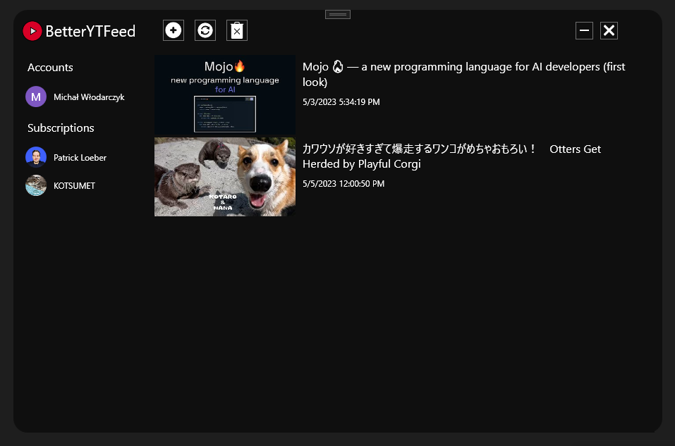

# BetterYouTubeFeed
.NET course project - Desktop app with database and use of YouTube Data API

## Aplication
Aplication handles communication with YouTube Data API.
Created in C# with WPF for UI and Entity Framework for database use.

## Project Group:
[@MaciejKiec](https://github.com/MaciejKiec)
[@mwlodarzc](https://github.com/mwlodarzc)